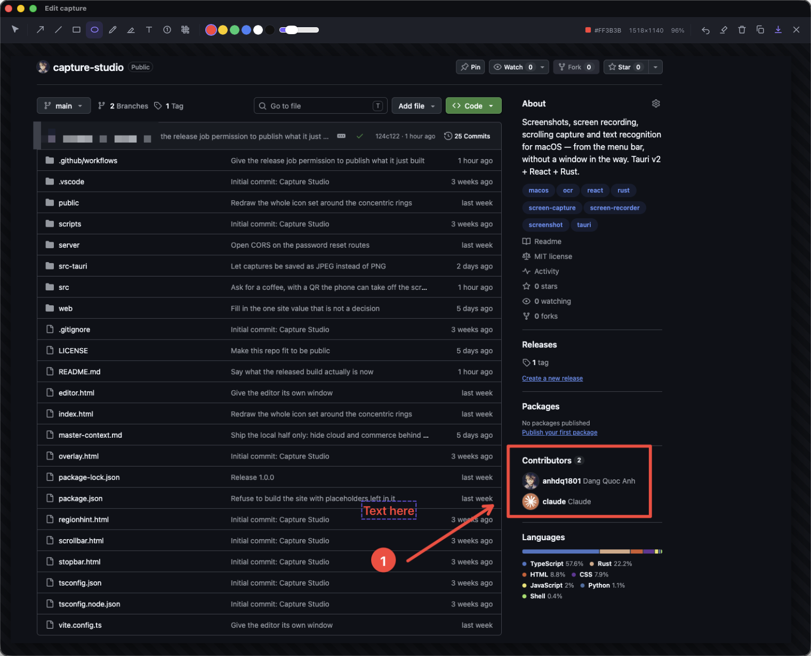
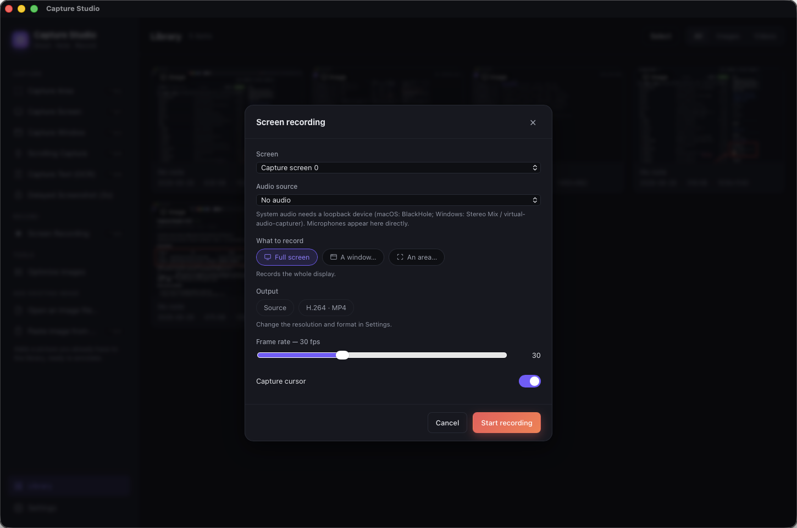
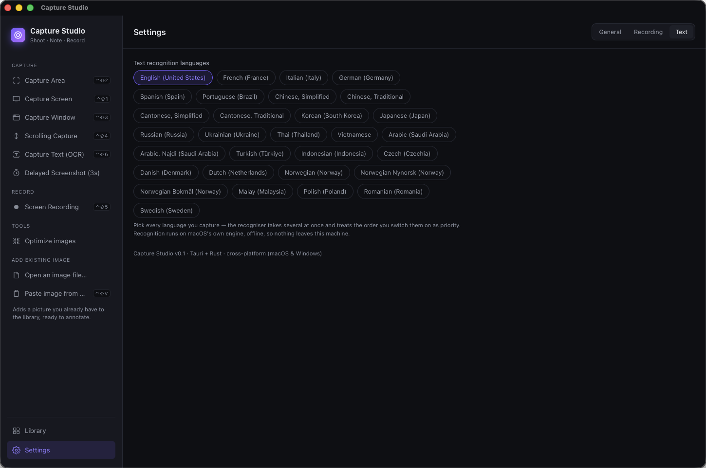
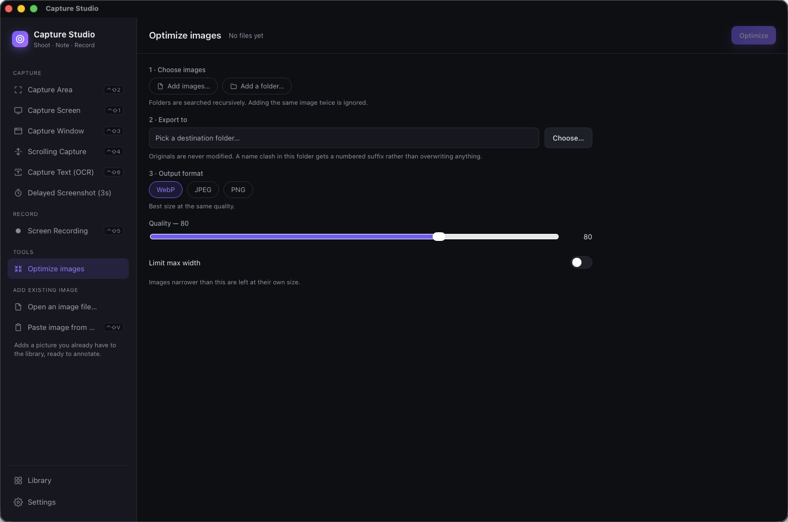
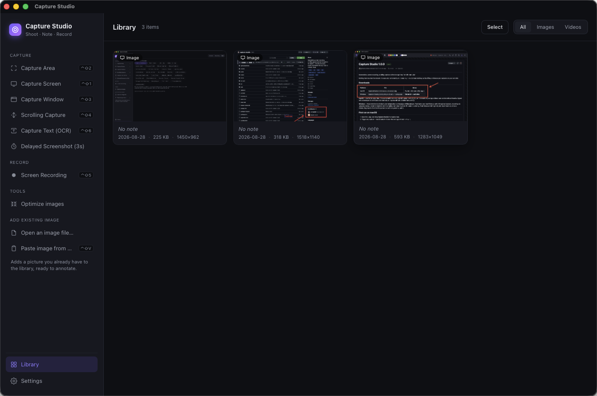

# Capture Studio

Screenshots, screen recording, scrolling capture and text recognition for macOS — from the menu
bar, without a window in the way. Built with **Tauri v2 + React + Rust**.



<p align="center"><em>The editor opens on every capture, before anything is saved.</em></p>

| | |
|:--:|:--:|
|  |  |
| **Record** the screen, a window, or one region | **Read text** off the screen, offline, in your language |
|  |  |
| **Optimise** a whole folder to WebP, JPEG or PNG | **Everything you kept**, on your own disk |

---

## Download

Download the `.dmg` from [Releases](https://github.com/anhdq1801/capture-studio/releases).

One file covers every Mac: the build is a universal binary carrying both `arm64` and `x86_64`,
so it runs natively on Apple Silicon and on Intel without Rosetta. macOS picks the right half at
launch; the other one only takes up disk space.

### First run

**1. Install.** Open the `.dmg` and drag **Capture Studio** into Applications.

**2. Grant Screen Recording, then restart the app.** macOS applies that permission only to a
*fresh launch*, so granting it does nothing to the app that is already running. Quit Capture
Studio completely and open it again.

Skipping the restart is the one mistake that looks like a broken app rather than a missing
permission: captures come back as the bare desktop wallpaper with every window stripped out,
because that is exactly what macOS hands to an app it has not authorised.

**3. For screen recording only, install ffmpeg.**

```bash
brew install ffmpeg          # macOS
winget install ffmpeg        # Windows — winget ships with Windows 10 and 11
```

Screenshots, annotation, OCR, scrolling capture and the optimiser all work without it;
recording is the only feature that does not. The app finds ffmpeg on its own — Homebrew,
MacPorts, winget, Chocolatey, Scoop or anything already on `PATH`, no configuration. If it is
still not found, **Settings › Recording** has the command for your platform and a button to
check again without restarting.

---

## Features

- **Capture Area, Screen, Window**, and a **3-second delayed** shot — from the menu bar, the
  sidebar, or a global shortcut.
- **Scrolling Capture** — stitch a page taller than the screen.
- **Capture Text (OCR)** — recognise text in a region straight to the clipboard, using the
  recogniser built into the operating system: Vision on macOS, `Windows.Media.Ocr` on Windows.
  No download, no model files, no API key. Vietnamese and English work out of the box on macOS;
  on Windows they depend on which language packs are installed, and the app says which are
  missing. A panel opens beside the region with what was read, laid back out into paragraphs.
  On macOS anything the recogniser was unsure about is marked so you can correct it before
  pasting — Windows reports no confidence scores, so nothing is marked there.
- **Screen recording** — full screen or a region, microphone or loopback audio, adjustable frame
  rate and cursor capture, with a floating stop bar and a live timer. Outputs `.mp4`.
- **Annotation editor** — arrow, line, rectangle, ellipse, pen, highlighter, text,
  **step-numbers** and **blur/redact**, with a colour and stroke palette, live hex/size/zoom
  readout, undo, copy to clipboard and save-in-place.
- **Image optimiser** — re-encode to WebP / JPEG / PNG with a quality slider and optional
  downscale, showing before/after sizes. PNG goes through lossless `oxipng`.
- **Library** — a grid of everything captured, with notes, reveal-in-Finder and delete.
- **PNG or JPEG** — pick which one captures are saved as in **Settings › General › Screenshot
  format**. PNG is the default and is lossless; JPEG is much smaller but drops transparency and
  is slightly lossy. The choice applies to new captures only — anything already in your library
  keeps the format it was saved in.
- **Import** — an existing image file, or whatever is on the clipboard.
- **Menu-bar app** — closing the window hides it to the tray rather than quitting. Optional
  launch at startup.
Nothing here touches the network. There is no account, no telemetry and no licence key: every
feature above is free, works offline, and keeps your captures on your own disk. See
[Cloud upload](#cloud-upload) for the part that is written but not shipped.

---

## Global shortcuts

Every one of these is **rebindable** in **Settings › General › Global shortcuts**. Click a
shortcut, press the keys you want; `Backspace` removes it, `Esc` cancels.

| Action | Default |
|--------|---------|
| Capture Area | ⌃⇧2 |
| Capture Screen | ⌃⇧1 |
| Capture Window | ⌃⇧3 |
| Scrolling Capture | ⌃⇧4 |
| Capture Text (OCR) | ⌃⇧6 |
| Screen Recording | ⌃⇧5 |
| Paste Image From Clipboard | ⌃⇧V |

They work anywhere, even with the window hidden in the menu bar.

That is **Control**, not Command. macOS keeps ⇧⌘3 through ⇧⌘6 for its own screenshot tools and
wins every one of them, so a ⇧⌘ set would arrive with four of its seven shortcuts already dead.
⌃⇧ is clear at the system level. (On Windows the same defaults read as `Ctrl+Shift+…`.)

> **If a shortcut does nothing, something else on your Mac owns it.** Settings marks a row
> *in use elsewhere* when the system refuses the registration outright — but an app that grabs
> keys through an event tap shadows ours without any error, so silence is the symptom to watch
> for. Rebind and move on.

---

## Building from source

Needed on every platform:

- **Node.js** `^20.19.0` or `>=22.12.0` — Vite 7 does not run on Node 18.
- **Rust** (stable) — https://rustup.rs

```bash
npm install
npm run tauri dev      # run it
npm run tauri build    # produce a distributable
```

Everything works straight from a clone — no keys, no accounts, no services to sign up for.

### macOS

Xcode Command Line Tools, which you almost certainly already have:

```bash
xcode-select --install
```

`npm run tauri build` produces `.app` and `.dmg` under
`src-tauri/target/release/bundle/`, built for whichever architecture the machine is.

Signing is read from the environment rather than committed, so a clone builds on any Mac
without needing somebody else's certificate:

```bash
export APPLE_SIGNING_IDENTITY="<your certificate's SHA-1, from: security find-identity -v -p codesigning>"
```

Without it the build still succeeds, unsigned — fine for running it yourself, not for handing
to anyone else. To notarise as well, set `APPLE_ID`, `APPLE_PASSWORD` (an app-specific
password) and `APPLE_TEAM_ID` before building. Note that the certificate has to be a
**Developer ID Application** one; an *Apple Development* certificate signs fine but Apple
refuses to notarise it.

Tauri notarises and staples the `.app`, then builds the `.dmg` and only *signs* it — the disk
image itself never receives a ticket, so anyone downloading it is stopped by Gatekeeper before
the stapled app inside is ever reached. Submit it separately:

```bash
cd src-tauri/target/universal-apple-darwin/release/bundle/dmg
# Named once rather than twice, so a version bump does not leave one of these two lines
# pointing at a file that is no longer there.
dmg="Capture Studio_1.1.0_universal.dmg"
xcrun notarytool submit "$dmg" --keychain-profile "<profile>" --wait
xcrun stapler staple "$dmg"
```

Treat a release as unfinished until `xcrun stapler validate` passes on *both* bundles. The
honest end-to-end check is to copy the `.dmg`, set `com.apple.quarantine` on the copy and
confirm `spctl -a -t open --context context:primary-signature` still says accepted — without
that attribute the check never exercises what a real download does.

Releases are universal binaries, which needs the Intel target installed once:

```bash
rustup target add x86_64-apple-darwin
npm run tauri build -- --target universal-apple-darwin
```

The plain `npm run tauri build` above is the faster arm64-only build, for development.

### Windows

> **Untested.** The Rust source has Windows paths throughout — screen capture, recording via
> `gdigrab`/`dshow`, reveal-in-Explorer — and the macOS-only dependencies are gated so they are
> never compiled elsewhere. But nobody has built or run this on Windows, so treat it as a
> starting point rather than a supported target. Text recognition does work on Windows, through
> `Windows.Media.Ocr`, but it needs at least one language pack with the OCR feature installed —
> Settings > Time & language > Language & region > a language's options > Optical character
> recognition. Without one, the app says so rather than failing silently.

Install, in this order:

1. **Visual Studio Build Tools** — https://visualstudio.microsoft.com/visual-cpp-build-tools/
   In the installer, tick the **Desktop development with C++** workload. Rust's default Windows
   toolchain links through MSVC, so without this `cargo build` fails at the linker.
2. **Rust** — https://rustup.rs (take the default `x86_64-pc-windows-msvc` toolchain).
3. **Node.js** `20.19+` or `22.12+` — https://nodejs.org
4. **WebView2 Runtime** — already present on Windows 11 and current Windows 10. On an older
   machine, install the Evergreen runtime from
   https://developer.microsoft.com/microsoft-edge/webview2/
5. **ffmpeg**, only if you want screen recording. Download from https://ffmpeg.org and put
   `ffmpeg.exe` on `PATH`. The app also looks in `C:\ffmpeg\bin`, the Chocolatey shim directory
   and `C:\Program Files\ffmpeg\bin`, so a standard install needs no configuration.

Then:

```powershell
npm install
npm run tauri build
```

The installers land in `src-tauri\target\release\bundle\` — `.msi` (WiX) and `.exe` (NSIS).

One thing that differs from macOS if you get it running: capturing what you hear needs a
loopback audio device (Stereo Mix, or a virtual audio cable). Microphones work as they are. The
shortcuts are the same `Ctrl+Shift+…` on both platforms.

---

## Architecture

| Layer | Tech |
|-------|------|
| Screenshot capture | Rust `xcap` |
| Image encode/optimize | Rust `image`, `webp` (libwebp), `oxipng` |
| Screen recording | system `ffmpeg` (avfoundation on macOS, gdigrab + dshow on Windows) |
| Text recognition | OS engines: Apple Vision via `objc2-vision`, `Windows.Media.Ocr` via `windows` |
| UI | React + TypeScript + Vite |
| Shell | Tauri v2 |

Captures live in `~/Pictures/CaptureStudio/`, indexed by `library.json`, with preferences in
`settings.json` beside it.

> **Continuing this project in another editor?** Read [`master-context.md`](master-context.md) —
> it documents the architecture, every backend command, the frontend data flow, the gotchas, and
> a prioritized list of next tasks.

---

## Cloud upload

**Not in this build.** Capture Studio is a local tool: captures live in a folder on your Mac and
go no further.

The repository does contain a complete cloud-upload feature — a Cloudflare Workers backend
(`server/`) for accounts, subscriptions and shareable links. It is switched off at
`src/lib/features.ts` (`COMMERCE_ENABLED = false`) because the backend is not deployed and the
service is not for sale, and shipping a Log in button that cannot reach a server is worse than
not showing one. If you want it, deploy your own — see [`server/README.md`](server/README.md)
— then point `API_BASE` in `src-tauri/src/cloud.rs` at it and flip the flag.

---

## Roadmap

See [`master-context.md`](master-context.md) for full status. Outstanding:

- Individual annotation select/move/delete, and video trimming.
- Bundling ffmpeg so recording works without a separate install.
- A universal (Intel + Apple Silicon) build, and notarisation, so the `.dmg` opens without the
  Gatekeeper detour.
- Cloud upload is code-complete but switched off: the backend (`server/`) is not deployed and
  there is no paid plan. See [Cloud upload](#cloud-upload).

---

## Licence

MIT — see [`LICENSE`](LICENSE). Use it, change it, ship it.

The Windows target especially: there is no Windows binary to download, so building it yourself
is the only way to run it there. If you get it working, a note about what you had to fix would
be welcome.
